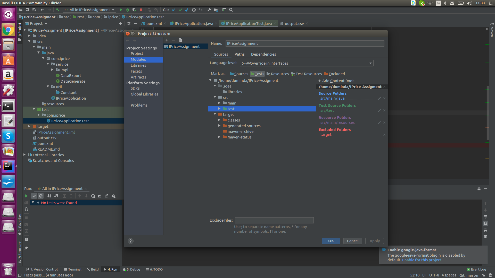

# IPrice-Assigment
This application consists with three main functionalities 

1. converts the string to uppercase and outputs it to stdout.
2. converts the string to alternate upper and lower case and outputs it to stdout.
3. creates a CSV file from the string by making each character a column in the CSV and then output "CSV created!" to stdout.

I have created this application using intellij idea. Follow below steps to set up the application on your machine.

1. Clone the repository using below link 
	
	https://github.com/DumindaManjula/IPrice-Assigment.git
2. Open the cloned appplication in intellij idea.
3. Run the IpriceApplication java class as the main class by right clicking on it.In the console(CLI) text will appear requesting string value to perform any activity.
4. Once you entered that text value press enter, next it will appear above three option to choose to perform for each activities. Type A,B or C option among them and hit enter.
5. Then it will appear the output for each performed task. If you enter C option to generate excel file, it will generate the CSV file on root folder as output.csv and will be printed on CLI as 'CSV created!' .

I have made some assumption since the requirement was not much in detail.Find those below

1. If user enters a string with number or symbols it will perform the task without doing any validation and if letters contains in that string , those letters will perform respective actions.

Note: To perform Junit testing follow below steps.

1. In Intelij Go to File > Modules and select test folder and mark as test and hit apply button.

2. In IpriceApplicationTest class you can apply defined test cases for each functionalities.
